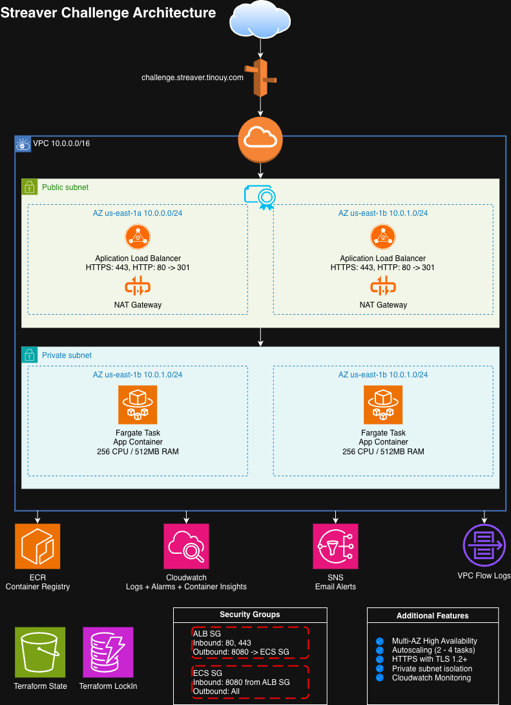

# Streaver DevOps Challenge

Production-ready AWS infrastructure for a containerized Python application, provisioned with Terraform and deployed via GitHub Actions.

## Repository Structure

The project is split into three repositories:

| Repository | Description |
|------------|-------------|
| [streaver-challenge](https://github.com/tinouy/streaver-challenge) | Documentation (this repo) |
| [streaver-challenge-app](https://github.com/tinouy/streaver-challenge-app) | Application code, Dockerfile, and CI pipeline |
| [streaver-challenge-terraform](https://github.com/tinouy/streaver-challenge-terraform) | Terraform infrastructure code and CI/CD pipelines |

## Architecture



- **Networking**: VPC with 2 AZs, public subnets (ALB), private subnets (ECS tasks), NAT Gateway per AZ
- **Compute**: ECS Fargate running the containerized app with health checks and circuit breaker rollback
- **Load Balancing**: Internet-facing ALB with HTTPS (TLS 1.3) and HTTP→HTTPS redirect
- **DNS & TLS**: Route53 hosted zone + ACM certificate with DNS validation (domain delegated from Cloudflare)
- **Auto Scaling**: Target tracking policies on CPU (70%), Memory (80%), and Request Count (1000 req/target)
- **Observability**: CloudWatch Logs (14-day retention), Container Insights, SNS alerts for CPU/memory/5XX/unhealthy hosts/low task count
- **Security**: Least-privilege IAM, ECS tasks in private subnets, SG allows only ALB→ECS traffic, VPC Flow Logs, encrypted state in S3

## Application

A minimal FastAPI application with three endpoints:

| Endpoint  | Status | Purpose                          |
|-----------|--------|----------------------------------|
| `/`       | 200    | Hello world                      |
| `/health` | 200    | Health check (used by ALB + ECS) |
| `/error`  | 500    | Intentional error for alerting   |

The Dockerfile uses a multi-stage build with `python:3.12-slim`, runs as a non-root user, and pins the platform to `linux/amd64` for Fargate compatibility.

## Infrastructure

Terraform is split into two root modules to break the dependency chain:

### `bootstrap/` (apply first)

Resources that must exist before the main infrastructure and require manual steps (DNS delegation, image push):

- ECR repository with lifecycle policy and scan-on-push
- Route53 hosted zone for the domain
- ACM certificate with DNS validation
- SSM Parameters to share outputs with the main module

### `main/` (apply second)

Runtime infrastructure that reads bootstrap values from SSM Parameter Store:

- VPC, subnets, Internet Gateway, NAT Gateways, route tables, flow logs
- ALB with HTTPS listener, target group, HTTP→HTTPS redirect
- ECS cluster, service, task definition
- IAM roles (execution + task) with least-privilege policies
- CloudWatch log groups, metric alarms, SNS topic
- Application Auto Scaling policies

### State Management

Each module stores its Terraform state in a dedicated S3 bucket with DynamoDB locking:

- `streaver-challenge-terraform-bootstrap` — bootstrap state
- `streaver-challenge-terraform-main` — main state

## Prerequisites

- AWS account with an IAM user that has the required permissions
- AWS CLI configured
- Terraform >= 1.5
- Docker
- S3 buckets and DynamoDB table (`terraform-locks`) created for state storage

## Deploy

### 1. Bootstrap infrastructure

```bash
cd terraform/bootstrap
terraform init
terraform apply
```

After apply:
- Copy the `route53_nameservers` output and set NS records in your DNS provider (e.g. Cloudflare)
- Wait for DNS propagation

### 2. Build and push the container image

```bash
ECR_URL=$(terraform output -raw ecr_repository_url)
aws ecr get-login-password --region us-east-1 | docker login --username AWS --password-stdin "$ECR_URL"
docker build --platform linux/amd64 -t "$ECR_URL:latest" ../app
docker push "$ECR_URL:latest"
```

### 3. Deploy main infrastructure

```bash
cd ../main
terraform init
terraform apply
```

The main module reads `ecr_repository_url`, `route53_zone_id`, and `acm_certificate_arn` automatically from SSM Parameter Store.

### 4. Verify

```bash
terraform output alb_url
curl https://challenge.streaver.tinouy.com/
curl https://challenge.streaver.tinouy.com/health
curl https://challenge.streaver.tinouy.com/error
```

## CI/CD Pipelines

### App repo (`streaver-challenge-app`)

- **Build & Push to ECR** — triggers on push to `main`, builds the Docker image with `--platform linux/amd64`, tags with commit SHA + `latest`, and pushes to ECR

### Terraform repo (`streaver-challenge-terraform`)

- **Terraform Plan & Apply** — triggers on push/PR to `main`. Plans both modules in parallel. Apply runs sequentially (bootstrap first, then main) and requires manual approval via the `production` GitHub environment
- **Terraform Destroy** — manual trigger only (`workflow_dispatch`). Destroys main first, then bootstrap. Both steps require approval via the `destroy` GitHub environment

### GitHub Secrets required

Both repos need these repository secrets configured:
- `AWS_ACCESS_KEY_ID`
- `AWS_SECRET_ACCESS_KEY`

### GitHub Environments required (terraform repo)

- `production` — with required reviewers, used for plan/apply workflow
- `destroy` — with required reviewers, used for destroy workflow

## Configure Alerts

```bash
cd terraform/main
terraform apply -var="alert_email=you@example.com"
```

Confirm the SNS subscription in your email inbox.

## Destroy

### Via GitHub Actions (recommended)

1. Go to the terraform repo > Actions > "Terraform Destroy"
2. Click "Run workflow"
3. Approve main destroy, then approve bootstrap destroy

### Manually

```bash
# Destroy main first (depends on bootstrap resources)
cd terraform/main
terraform init
terraform destroy

# Then destroy bootstrap
cd ../bootstrap
terraform init
terraform destroy
```

**Note**: Remember to also delete the S3 state buckets and DynamoDB lock table if you want a full cleanup.

## What I Would Improve With More Time

- **WAF**: Attach AWS WAF to the ALB for rate limiting and common exploit protection
- **Structured logging**: JSON-formatted logs with request IDs for correlation
- **Container vulnerability scanning**: Integrate Trivy or Snyk into the CI pipeline
- **Load testing**: k6, Locust, JMeter script to validate scaling behavior
- **Separate environments**: Use Terraform workspaces or variable files for staging/production separation
- **ECS deployment via CI**: Auto-update the ECS task definition with the new image tag after push
